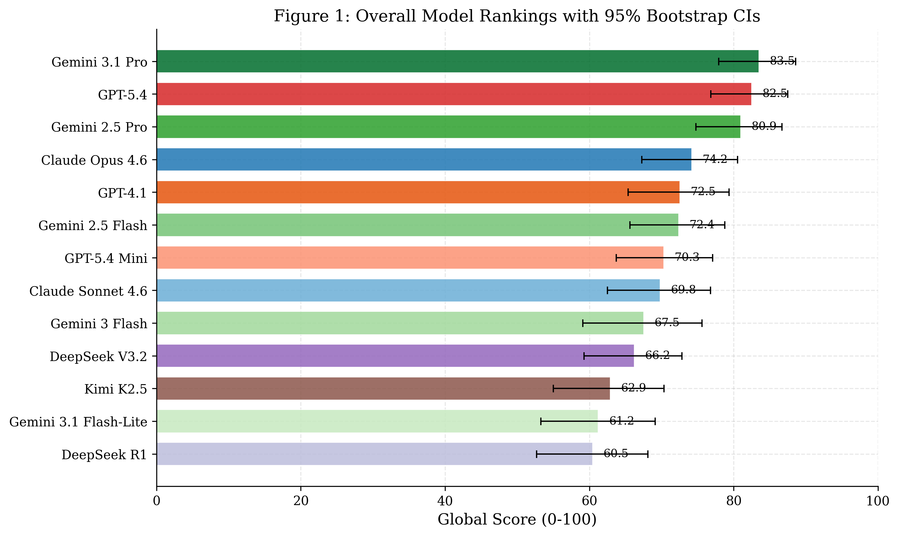
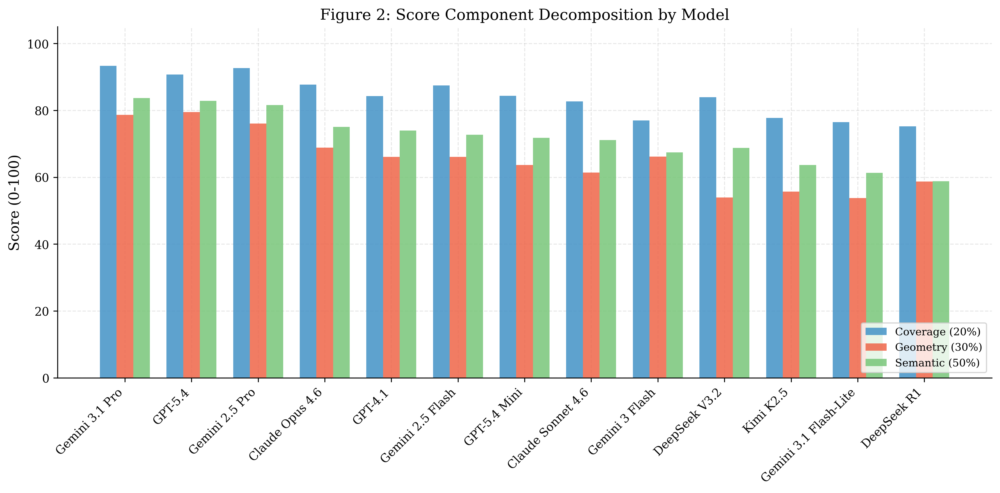
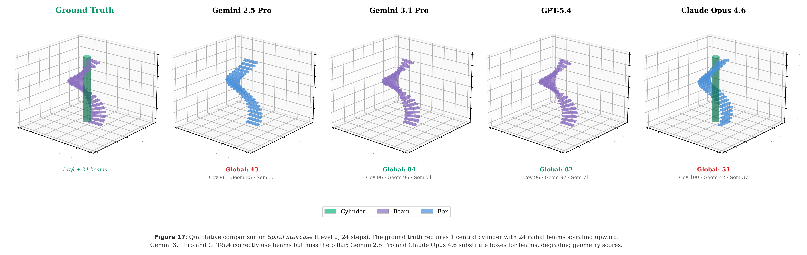
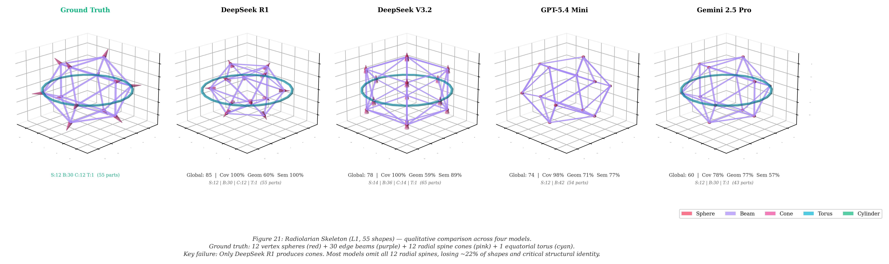
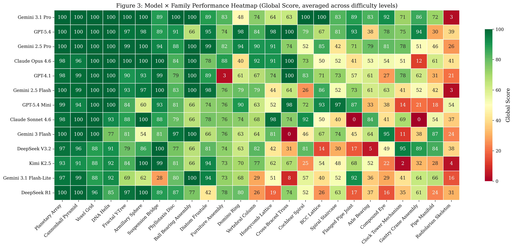
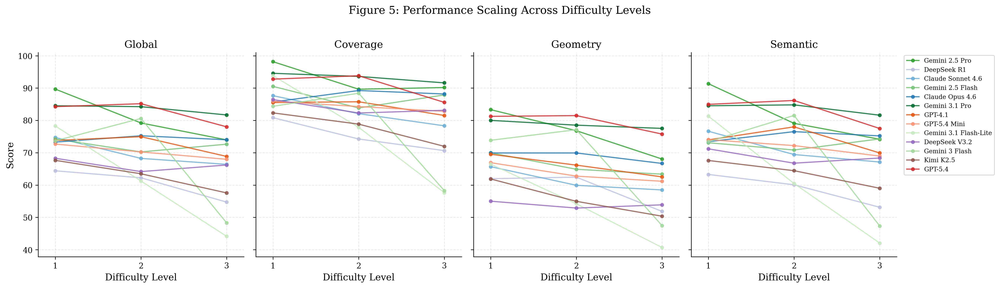
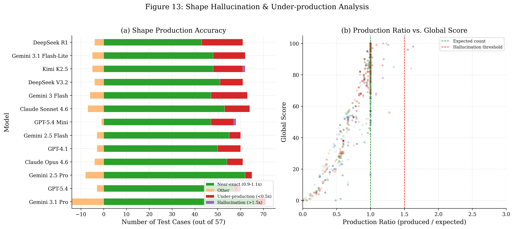
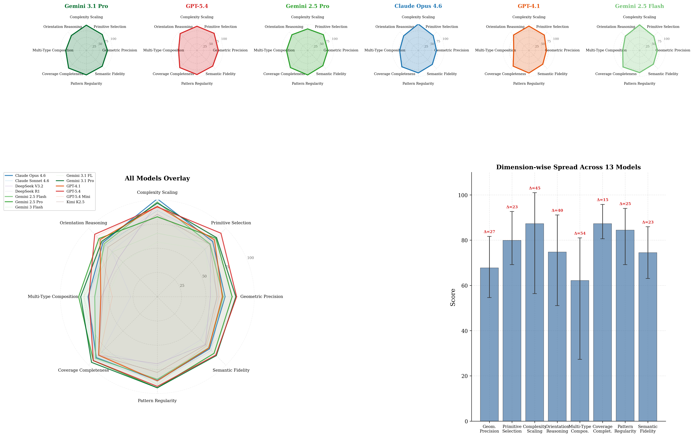

# C2CAD-Bench

**A Large-Scale Benchmark for 3D Spatial Reasoning and CAD Geometry Generation.**



C2CAD-Bench evaluates the multi-step spatial reasoning capabilities of Large Language Models (LLMs) in generating deterministic CAD geometry. The benchmark requires models to map high-level engineering specifications to precise parametric primitives.

---

## Technical Highlights

- **75 Test Cases**: Spanning 25 distinct test families across three complexity levels.
- **13 Frontier LLMs**: Comparative evaluation of state-of-the-art models including Gemini, GPT, Claude, and DeepSeek.
- **Multi-Dimensional Scoring**: Automated evaluation pipeline covering **Coverage (20%)**, **Geometry (30%)**, and **Semantic Validation (50%)**.
- **Parametric Ground Truth**: Every case is evaluated against deterministic golden-reference geometry.

---

## Metric Decomposition

The scoring methodology prioritizes structural and functional validity over mere shape production. The following decomposition illustrates model performance across the three primary scoring dimensions.



---

## Showcase Gallery: Model Performance

The following table demonstrates model performance across various geometric and engineering tasks, highlighting the diversity in spatial grounding and hallucination profiles.

| Challenge | Overview and Results |
| :--- | :--- |
| **Spiral Staircase**<br>(Phase 1: Basic Geometric Forms)<br><br>Tests trigonometric accuracy and polar pattern repetition. |  |
| **Radiolarian Skeleton**<br>(Phase 4: Bio-Inspired Assemblies)<br><br>Tests high-order recursive patterns and geodesic frame generation. |  |
| **Pipe Manifold**<br>(Phase 3: Engineering Constraints)<br><br>Tests concentricity, clearance, and gravity-mated assembly constraints. | *The Pipe Manifold challenge requires precise alignment of ports and support structures.*<br>[View Pipe Manifold results in Heatmap ↓](#model-family-performance-matrix) |
| **Voxel Grid & DNA Helix**<br>(Phases 1 & 2)<br><br>Tests volumetric filling and parametric double-helix pathing. | *Frontier models consistently achieve maximum coverage on these foundational parametric tasks.*<br>[View Detailed Matrix ↓](#model-family-performance-matrix) |

---

## Model-Family Performance Matrix

The heatmap below provides a comprehensive overview of global scores across all 25 test families. This matrix reveals specific model strengths and failure modes in complex engineering scenarios.



---

## Robustness and Scaling Analysis

### Performance Scaling across Complexity Levels
As task complexity increases from Level 1 to Level 3, most models exhibit significant performance degradation. This analysis breaks down the robustness of coverage, geometry, and semantic logic.



### Shape Hallucination and Production Accuracy
We track production ratios to identify "shape hallucinations" (excessive geometry) vs. "under-production" (partial structural failures).



---

## Cognitive Capacity Profiles

Radar profiles visualize model capability across different reasoning dimensions, providing a "spatial signature" for each model family.



---

## Benchmark Phases

C2CAD-Bench is structured into four phases of increasing dimensionality and constraint complexity:

- **Phase 1: Geometric Forms**: Primitives, bolt patterns, and basic rotations.
- **Phase 2: Complex Structures**: Lattices, pitch-circle constraints, and formula derivation.
- **Phase 3: Engineering Constraints**: Concentricity, clearance, and gravity-mated assemblies.
- **Phase 4: Bio-Inspired Assemblies**: Biological morphology and recursive geodesic frames.

---

## Getting Started

### Environment Setup

Python 3.10+ is required.

```bash
python -m venv .venv
# Windows:
.venv\Scripts\activate
# macOS/Linux:
source .venv/bin/activate

python -m pip install -r requirements.txt
```

### Verification Checks

To verify the installation and data artifact without API usage:

```bash
python runners\run_unified.py --list-models
python runners\check_artifact.py
```

### Execution of Live Evaluations

1. Configure API keys in a `.env` file (see `.env.example`).
2. Run evaluations for a specific model:

```bash
python runners\run_unified.py --all --model gemini-2.5-pro
```

---

## Repository Structure

```text
C2CAD-Bench/
├── probe/          # Core schema and validation logic
├── runners/        # Benchmark execution and scoring utilities
├── stages/         # Parametric golden-reference generators
├── results/        # Analysis figures and evaluation database
├── ui/             # WebGL visualizer and result dashboard
├── SCORING_RULES.md
└── requirements.txt
```

---

## License

C2CAD-Bench is released under the **MIT License**. For anonymous review purposes, please adhere to the metadata guidelines specified in the paper.
